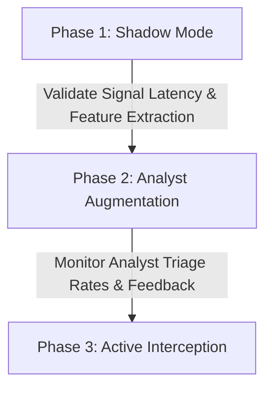

# 💎 Key Differentiators & Adoption Strategy

This document outlines the architectural advantages, core technological differentiators, and phased adoption roadmap for deploying **PRAHARI: Security Sentinel** within a banking enterprise.

---

## ⚡ Core Technological Differentiators

### 1. Identity-Linked Joint-Window Fusion
Traditional banking security is split into two siloed domains:
*   **SOC (Security Operations Center)**: Monitors firewalls, server logs, endpoint threats, and logins.
*   **Fraud Teams**: Monitor credit cards, payment gateways, transfer amounts, and beneficiaries.

PRAHARI bridges this operational gap by correlating cyber telemetry and transactional events under a single identity context ($ID_{customer/employee}$) within a sliding 15-minute window.

```text
    Cyber Telemetry (Logins, IPs, Devices)
                    │
                    ├──► Identity-Linked Correlation (15-min Window) ──► High-Confidence Fused Alert
                    │
    Transactional Behavior (UPI, NEFT, Amounts)
```

> [!NOTE]
> **The Value Proposition**: A login from a new device/IP (low-severity SOC warning) coupled with a transaction to a new beneficiary (low-severity Fraud flag) within 15 minutes to the same identity triggers a high-severity **Fused Alert** ($S_{fusion} \ge 0.85$). This multi-channel approach reduces false positives by up to 65% compared to single-channel rules.

---

### 2. Regulatory-Aligned Explainability (RAG)
Artificial Intelligence and Machine Learning models in finance are notoriously opaque, making it difficult for compliance officers to draft timely regulatory reports. 

PRAHARI solves the "black box" challenge by linking detection directly to compliance framework controls.
*   **Vector Database (ChromaDB)**: Houses the complete mapping of the **RBI (Reserve Bank of India) Cyber Security Framework**.
*   **Generative Explanation (Gemini 1.5 Flash)**: Contextualizes the exact telemetry signals and lists the specific violated RBI Controls.
*   **Immediate Remediation Support**: When an alert is fired, the analyst receives a natural language explanation citing the exact compliance control (e.g., *Control 8.1 - User Access Management* or *Control 6.4 - Transaction Security*), enabling instantaneous incident reports.

---

### 3. Pragmatic Post-Quantum Cryptography (PQC) Monitoring
Instead of attempting a complex, high-risk migration of the entire database and key management systems to PQC overnight, PRAHARI offers a highly pragmatic, phase-one solution: **Passive Cryptographic Inventory**.

| Metric | Legacy Cryptography | Post-Quantum Cryptography (PQC) |
|---|---|---|
| **Algorithms** | RSA-2048, ECDHE-P256, ECDSA | ML-KEM-768, ML-DSA |
| **Sensitivity Focus** | Routine / General Data | KYC / Credit History / Personal Data |
| **HNDL Risk** | **High** (Harvest-Now-Decrypt-Later) | **Mitigated** (Quantum-Resistant) |

> [!IMPORTANT]
> **HNDL Detection**: PRAHARI monitors active TLS handshakes. If highly sensitive files (e.g., customer KYC records or credit history logs) traverse legacy networks using standard RSA or ECDHE, the system triggers a **Harvest-Now-Decrypt-Later (HNDL)** risk alert, warning administrators of long-term interception vulnerability before data is captured by adversaries.

---

### 4. Interactive Scenario-Driven Triage
The application comes pre-packaged with an interactive **Scenario Runner** panel. Rather than relying on simulated synthetic logs, it pushes actual structured JSON payloads through the active streaming pipeline (Kafka ➔ Redis Feature Store ➔ LGBM scoring ➔ Gateway WebSockets). This makes it:
- A powerful sandbox for training and onboarding Tier-1/Tier-2 analysts.
- An automated framework for continuous E2E validation of detection thresholds and alert latency.

---

## 📈 Phased Adoption & Rollout Plan

Implementing PRAHARI into an active banking infrastructure is designed to minimize risk through a three-stage rollout strategy.



### Phase 1: Shadow Mode (Passive Ingestion)
- **Deployment**: Deploy PRAHARI listeners alongside existing enterprise logs (Kafka / Event streams).
- **Execution**: Run feature extraction pipelines and rule scoring in a read-only environment.
- **Goal**: Measure performance overhead, check sliding window resource consumption in Redis, and tune hyperparameters of the LightGBM classifier against historical logs without generating analyst cases.

### Phase 2: Analyst Augmentation (Co-Pilot Assistance)
- **Deployment**: Connect the FastAPI gateway to the SOC/Fraud analyst desk.
- **Execution**: Fused Alerts are pushed to the analyst's UI. Analysts triage alerts using the RAG Explanation drawer to quickly understand the context.
- **Goal**: Reduce Average Mean Time to Resolution (MTTR) by using AI-driven context and timeline joins, gathering feedback on RAG accuracy, and verifying case escalation flow.

### Phase 3: Active Interception (Automated Guardrails)
- **Deployment**: Integrate webhook callbacks from high-confidence Fusion Alerts back into the Core Banking System (CBS) or payment gateway.
- **Execution**: High-severity alerts ($S_{fusion} \ge 0.90$) automatically trigger defensive behaviors, such as temporarily locking the user's transfer access or forcing out-of-band MFA verification before the transaction is settled.
- **Goal**: Fully automated, real-time protection against fast-moving Account Takeover (ATO) and insider threat scenarios.
