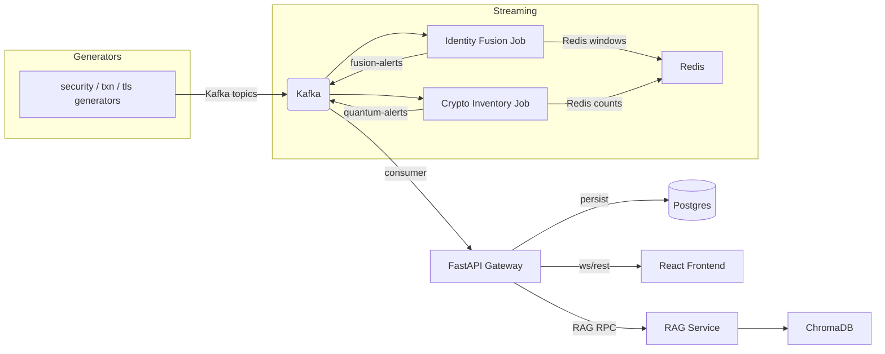

# 🛡️ Dhaal (ढाल) — Security Sentinel

AI-driven pipeline that correlates identity-linked cybersecurity telemetry with transactional behaviour to produce higher-confidence fused alerts, plus a deterministic crypto-inventory module for PQC/HNDL detection.

This README is generated from the repository contents. All statements below are verified against the code in this repository; see the referenced files for implementation details.

## Project summary
- Primary backend: FastAPI gateway (`services/gateway/main.py`).
- Streaming jobs: `streaming/run_all.py` with fusion and quantum jobs under `streaming/fusion` and `streaming/quantum`.
- Synthetic generators: `data/synthetic/generators` (used by demo & seeding).
- RAG explanation service: `services/rag_explanation` (ChromaDB + Gemini fallback).
- Fusion classifier: `services/fusion_classifier` (joblib model optional; rule fallback present).
- Frontend: React + Vite under `frontend`.

## Key implemented features (verified)
- Identity-linked fusion with a 15-minute sliding window and a 12-feature vector (see `streaming/fusion/features.py`).
- Fusion classifier endpoint `POST /internal/fusion/score` with a joblib-backed model and a deterministic fallback (`services/fusion_classifier/main.py`).
- RAG explanation service with retrieval (ChromaDB), generation (Gemini optional), and a 24h Redis cache (`services/rag_explanation/main.py`).
- Deterministic PQC/HNDL detection and quantum session alerts (`streaming/quantum/job.py`).
- FastAPI Gateway exposing alert/case/audit/quantum APIs, WebSocket broadcasting, KPI caching, and a demo scenario injector (`services/gateway/main.py`).
- Redis-based sliding-window feature store (`streaming/redis_client.py`).

## Tech stack
- Python 3.12+, FastAPI, SQLAlchemy (async), asyncpg
- Kafka (client: confluent-kafka), Redis, PostgreSQL
- ChromaDB (vector DB) and optional Google Gemini for RAG
- React + Vite frontend
- Docker & Docker Compose

## Architecture diagram


---

## ✨ Key Features in detail

### 1. Multi-Channel Correlation (Identity-Linked Joint Window)
Traditional systems separate network SIEM alerts from transactional fraud alerts. Dhaal (ढाल) links both using the customer/employee `identity_id`.
- **The Core Correlation**: An isolated new device login (low risk) coupled with an immediate high-value transfer to a new beneficiary (low risk) within a 15-minute sliding window triggers a high-severity **Fused Alert** ($S_{fusion} \ge 0.85$).
- **12-Feature Classification Vector**: Fuses spatial, temporal, transactional, and authentication features into a unified vector:
  1. `hour_of_day` (IST)
  2. `txn_amount_zscore` (Z-score relative to profile baseline)
  3. `beneficiary_is_new` (0/1 flag)
  4. `txn_velocity_1h` (Transaction count in window)
  5. `off_hours_txn_flag` (1 if transaction falls outside 09:00 - 18:00 IST)
  6. `cross_border_flag` (0/1 flag)
  7. `new_device_flag` (0/1 flag)
  8. `impossible_travel_flag` (0/1 flag)
  9. `failed_auth_count_1h` (Failed logins count in window)
  10. `privileged_cmd_count_1h` (Privileged commands count in window)
  11. `endpoint_alert_count_1h` (Security agent/endpoint alerts count)
  12. `joint_window_overlap_flag` (1 if both security AND transaction events present)

### 2. Regulatory-Aligned Explainability (RAG)
Avoids "black-box" ML decisions. Every alert is processed by a RAG microservice:
- **Retrieval**: Leverages ChromaDB vector database seeded with 7 core domains of the **RBI Cyber Security Framework** (User Access Control, DLP, Cryptographic Key Management, Transaction Security, Correlation, etc.).
- **Generation**: Calls Gemini-1.5-Flash to produce a 2-3 sentence, analyst-friendly markdown explanation detailing exactly which RBI controls have been violated and the raw contributing signals.
- **Caching**: Performance-optimized using a 24-hour Redis cache keyed by the MD5 hash of the sorted contributing signals.

### 3. Progressive-Disclosure Investigation Workspace
A premium, multi-tab slide-out drawer (960px width) designed for SOC Tier-2 analyst workflow:
*   **Tab 1: Explanation**: Live SSE-streamed RAG explanation + contributing anomaly signals.
*   **Tab 2: Customer Risk Profile**: Fetches 18+ rich fields from the synthetic banking dataset (KYC status, current balance, average daily volumes, device trust score, registered devices, known beneficiaries, historical case statistics).
*   **Tab 3: Unified Timeline**: Reconstructs the complete event story chronologically (e.g., *Account Opened* ➔ *Login Success* ➔ *Failed Privilege Command* ➔ *Transaction Triggered* ➔ *Alert Generated* ➔ *Case Opened*).

### 4. Post-Quantum Cryptography (PQC) Monitoring
Tracks the cryptographic state of TLS sessions traversing the bank's services.
- **Crypto Inventory**: Classifies algorithms against NIST FIPS 203/204/205 standards:
  - *Legacy*: RSA, ECDHE, ECDSA
  - *PQC-Ready*: ML-KEM, ML-DSA
  - *Hybrid*: X25519-MLKEM
- **Harvest-Now-Decrypt-Later (HNDL) Alerts**: Flags legacy handshakes transporting highly sensitive data (e.g., `kyc` or `credit_history`) to external destinations.

### 5. Interactive Scenario Runner
Gated behind `DEMO_MODE=true`, the Scenario Runner page in the UI allows administrators to inject 4 distinct attack scenarios directly into the live Kafka pipeline:
1. **Account Takeover (ATO)**: New device login + impossible travel followed by high-value transfer within 15 minutes.
2. **Insider Collusion**: Privileged employee data access followed by high-value transactions to a newly linked beneficiary.
3. **Credential Stuffing ➔ ATO**: Multiple failed logins from matching IP clusters across multiple identities, succeeding on one, followed by immediate transfer.
4. **HNDL Exposure**: Sensitive KYC transmission negotiated over weak legacy RSA key exchange.

### 6. Dual-Theme Aesthetics
A high-performance aesthetic theme engine built entirely with Vanilla CSS custom properties supporting:
- **Aero Theme**: A sleek, premium glassmorphic visual system with dark backgrounds, neon borders, and glowing real-time statuses.
- **Brutalist Theme**: A bold neo-brutalist interface featuring thick borders, high contrast, vibrant primary blocks, and a retro terminal typography feel.

---

## 📂 Project Directory Structure

```text
dhaal/
├── data/                       # Data generation & scenario definitions
│   └── synthetic/              # Generators for transactions, security, & TLS events
├── docs/                       # Functional and user flow documentation
├── frontend/                   # React + Vite frontend SPA (Aero & Brutalist themes)
├── scripts/                    # Database seeding and configuration scripts
├── services/                   # Backend Microservices
│   ├── fusion_classifier/      # LGBM model wrapper scoring endpoint
│   ├── gateway/                # FastAPI application gateway, WebSocket manager
│   └── rag_explanation/        # RAG pipeline with ChromaDB and Gemini
├── streaming/                  # Kafka Consumers, Feature Store, & Detection Jobs
│   ├── detection/              # Stateless detection rules
│   ├── fusion/                 # 12-Feature sliding window aggregator
│   └── quantum/                # PQC classifier & HNDL detector
└── tests/                      # Pytest backend test suite (unit + integration)
```

---

## Repository highlights
- `services/gateway/` — API server, models, schemas, WS manager.
- `services/fusion_classifier/` — classifier microservice (model file optional).
- `services/rag_explanation/` — retrieval + generator + SSE streaming.
- `streaming/` — streaming runner, fusion & quantum jobs, Redis client.
- `data/synthetic/generators/` — synthetic generators + scenario injector.
- `scripts/init_db.sql` — Postgres schema and indexes applied on DB init.

## Environment variables (from `.env.example`)
Copy `.env.example` → `.env` and edit values before running.

Variables present in the template:
- `KAFKA_BOOTSTRAP_SERVERS`, `REDIS_HOST`, `REDIS_PORT`
- `POSTGRES_HOST`, `POSTGRES_PORT`, `POSTGRES_DB`, `POSTGRES_USER`, `POSTGRES_PASSWORD`
- `CHROMA_HOST`, `CHROMA_PORT`
- `GEMINI_API_KEY` (optional; RAG falls back when missing)
- `GATEWAY_HOST`, `GATEWAY_PORT`, `FUSION_CLASSIFIER_URL`, `RAG_SERVICE_URL`
- `JWT_SECRET` (present but not enforced by the gateway code)
- `DEMO_MODE` (gates scenario injection)

See `.env.example` for exact keys and defaults.

## API overview (auto-discovered)
Primary API: FastAPI gateway (`/api`) implemented in `services/gateway/main.py`. Notable endpoints (all verified):

- `GET /api/alerts` — paginated fused alerts (cursor `before_id`, filters `severity`, `identity_id`).
- `GET /api/alerts/{alert_id}` — single alert detail.
- `POST /api/alerts/{alert_id}/escalate` — escalate alert; creates/updates Case and writes an audit entry.
- `POST /api/alerts/{alert_id}/dismiss` — dismiss alert; writes audit entry.
- `GET /api/alerts/{alert_id}/timeline` — assembled investigation timeline.
- `GET /api/cases` — paginated cases.
- `POST /api/cases/{case_id}/action` — perform case actions (ack/esc/dismiss).
- `GET /api/audit` — paginated audit trail.
- `GET /api/quantum/sessions` — paginated quantum/TLS sessions.
- `GET /api/dashboard/kpis` — dashboard KPIs (Redis cache, 30s TTL).
- `POST /api/demo/inject` — inject demo scenario into Kafka (requires `DEMO_MODE=true`).
- `GET /api/identities/{identity_id}` — identity profile from Postgres.
- `GET /api/graph/{identity_id}` and `GET /api/graph/expand/{node_id}` — investigation graph endpoints.

Other services:
- Fusion classifier: `POST /internal/fusion/score` (`services/fusion_classifier/main.py`).
- RAG service: `POST /api/explain` and `POST /api/explain/stream` (`services/rag_explanation/main.py`).

Schemas are defined in `services/gateway/schemas.py` and data models in `services/gateway/models.py`.

## Database & schema
- SQL schema and indexes: `scripts/init_db.sql` (tables: `alerts`, `quantum_alerts`, `cases`, `audit_trail`, `identity_profiles`).
- ORM models in `services/gateway/models.py` mirror the schema.

## ML components
- Feature extraction: `streaming/fusion/features.py` (exact 12 features listed in code).
- Classifier microservice: `services/fusion_classifier/main.py`. Looks for `fusion_model.joblib` (default path) and falls back to deterministic scoring when the model is absent or prediction fails.
- ChromaDB is seeded with RBI controls by `services/rag_explanation/corpus.py`.

## Security notes (current state in repo)
- `DEMO_MODE` safely gates the demo scenario injection endpoint and UI.
- `GEMINI_API_KEY` is optional; absence degrades RAG to a deterministic generator.
- `JWT_SECRET` exists in `.env` template but the gateway does not currently enforce authentication — this is documented in `docs/meta/LIMITATIONS.md`.

## Performance and reliability features implemented
- Bounded Kafka enqueue queue + fixed asyncio worker pool in the gateway to control concurrency and DB load.
- Cursor (keyset) pagination on list endpoints to avoid OFFSET scans.
- Redis caching for KPIs, quantum stats, and RAG explanations with TTLs and rate-limited invalidation.
- Database composite indexes and covering indexes created in `scripts/init_db.sql` to support efficient GROUP BY and keyset queries.

## Run with Docker Compose (recommended)
1. Copy `.env.example` to `.env` and edit values.
```bash
cp .env.example .env
```
2. Start infrastructure services (Kafka, Redis, Postgres, ChromaDB):
```bash
docker compose up -d
```
3. Start full stack (services with `profiles: ["full"]`):
```bash
docker compose --profile full up -d --build
```
4. Frontend: http://localhost:5173 (gateway on 8080 by default).

## Running locally (developer)
- Create venv and install: `pip install -r requirements.txt`.
- Start components individually (see `services/*` and `streaming/run_all.py`).

## Tests
- Backend: `pytest tests/` (uses fixtures in `tests/conftest.py`).
- Frontend: `cd frontend && npm run test`.
- E2E: `cd frontend && npx playwright test`.

## Known limitations (from repo)
- Gateway does not enforce JWT auth; endpoints are currently open for demo/test convenience (`docs/meta/LIMITATIONS.md`).
- Docker Compose stack is single-node demo oriented (not HA-ready).

## Future work (not implemented here)
- Enforce auth (JWT/OAuth) on gateway and WS.
- Replace rule-based fallback with a versioned model registry and add CI for model compatibility checks.
- Production-grade orchestration and HA for Kafka/Redis/Postgres, and distributed streaming (Flink).

