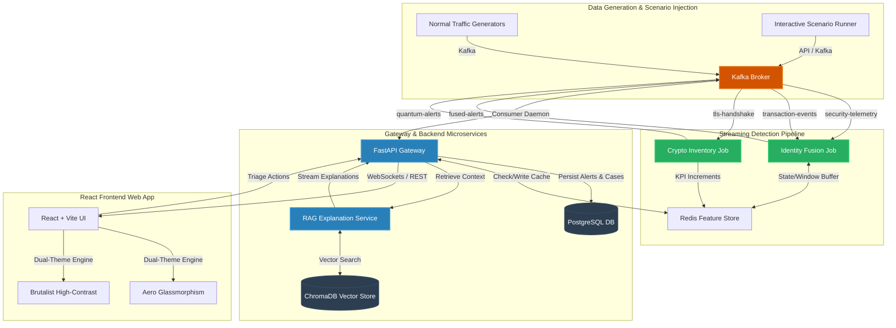

# 🛡️ PRAHARI: Security Sentinel
> **AI-Driven Correlation of Cybersecurity Telemetry & Transactional Behaviour**

PRAHARI (Hindi for *sentinel* or *watchman*) is a real-time detection and response pipeline designed to fuse identity-linked cybersecurity events (logins, endpoint alerts, network signals) with transactional banking behavior. By correlating these distinct telemetry streams inside a sliding 15-minute window, PRAHARI dramatically reduces false positives, bridging the gap between Security Operations Centers (SOC) and Fraud Investigation teams.

Additionally, PRAHARI incorporates a post-quantum cryptographic (PQC) monitoring inventory to track migration readiness and alert on Harvest-Now-Decrypt-Later (HNDL) exposure risks. All anomaly explanations are generated using a semantic RAG layer referencing the baseline controls of the **Reserve Bank of India (RBI) Cyber Security Framework**.

---

## 🏗️ Architecture



---

## ✨ Key Features

### 1. Multi-Channel Correlation (Identity-Linked Joint Window)
Traditional systems separate network SIEM alerts from transactional fraud alerts. PRAHARI links both using the customer/employee `identity_id`.
- **The Core Correlation**: An isolated new device login (low risk) coupled with an immediate high-value transfer to a new beneficiary (low risk) within a 15-minute sliding window triggers a high-severity **Fused Alert** ($S_{fusion} \ge 0.85$).
- **12-Feature Classification Vector**: Fuses spatial, temporal, transactional, and authentication features into a unified vector:
  1. `hour_of_day` (IST)
  2. `txn_amount_zscore` (Z-score relative to profile baseline)
  3. `beneficiary_is_new` (0/1 flag)
  4. `txn_velocity_1h` (Transaction count in window)
  5. `off_hours_txn_flag` (1 if transaction falls outside 09:00 - 18:00 IST)
  6. `cross_border_flag` (0/1 flag)
  7. `new_device_flag` (0/1 flag)
  8. `impossible_travel_flag` (0/1 flag)
  9. `failed_auth_count_1h` (Failed logins count in window)
  10. `privileged_cmd_count_1h` (Privileged commands count in window)
  11. `endpoint_alert_count_1h` (Security agent/endpoint alerts count)
  12. `joint_window_overlap_flag` (1 if both security AND transaction events present)

### 2. Regulatory-Aligned Explainability (RAG)
Avoids "black-box" ML decisions. Every alert is processed by a RAG microservice:
- **Retrieval**: Leverages ChromaDB vector database seeded with 7 core domains of the **RBI Cyber Security Framework** (User Access Control, DLP, Cryptographic Key Management, Transaction Security, Correlation, etc.).
- **Generation**: Calls Gemini-1.5-Flash to produce a 2-3 sentence, analyst-friendly markdown explanation detailing exactly which RBI controls have been violated and the raw contributing signals.
- **Caching**: Performance-optimized using a 24-hour Redis cache keyed by the MD5 hash of the sorted contributing signals.

### 3. Progressive-Disclosure Investigation Workspace
A premium, multi-tab slide-out drawer (960px width) designed for SOC Tier-2 analyst workflow:
*   **Tab 1: Explanation**: Live SSE-streamed RAG explanation + contributing anomaly signals.
*   **Tab 2: Customer Risk Profile**: Fetches 18+ rich fields from the synthetic banking dataset (KYC status, current balance, average daily volumes, device trust score, registered devices, known beneficiaries, historical case statistics).
*   **Tab 3: Unified Timeline**: Reconstructs the complete event story chronologically (e.g., *Account Opened* ➔ *Login Success* ➔ *Failed Privilege Command* ➔ *Transaction Triggered* ➔ *Alert Generated* ➔ *Case Opened*).

### 4. Post-Quantum Cryptography (PQC) Monitoring
Tracks the cryptographic state of TLS sessions traversing the bank's services.
- **Crypto Inventory**: Classifies algorithms against NIST FIPS 203/204/205 standards:
  - *Legacy*: RSA, ECDHE, ECDSA
  - *PQC-Ready*: ML-KEM, ML-DSA
  - *Hybrid*: X25519-MLKEM
- **Harvest-Now-Decrypt-Later (HNDL) Alerts**: Flags legacy handshakes transporting highly sensitive data (e.g., `kyc` or `credit_history`) to external destinations.

### 5. Interactive Scenario Runner
Gated behind `DEMO_MODE=true`, the Scenario Runner page in the UI allows administrators to inject 4 distinct attack scenarios directly into the live Kafka pipeline:
1. **Account Takeover (ATO)**: New device login + impossible travel followed by high-value transfer within 15 minutes.
2. **Insider Collusion**: Privileged employee data access followed by high-value transactions to a newly linked beneficiary.
3. **Credential Stuffing ➔ ATO**: Multiple failed logins from matching IP clusters across multiple identities, succeeding on one, followed by immediate transfer.
4. **HNDL Exposure**: Sensitive KYC transmission negotiated over weak legacy RSA key exchange.

### 6. Dual-Theme Aesthetics
A high-performance aesthetic theme engine built entirely with Vanilla CSS custom properties supporting:
- **Aero Theme**: A sleek, premium glassmorphic visual system with dark backgrounds, neon borders, and glowing real-time statuses.
- **Brutalist Theme**: A bold neo-brutalist interface featuring thick borders, high contrast, vibrant primary blocks, and a retro terminal typography feel.

---

## 📂 Project Directory Structure

```text
prahari/
├── data/                       # Data generation & scenario definitions
│   └── synthetic/              # Generators for transactions, security, & TLS events
├── docs/                       # Functional and user flow documentation
├── frontend/                   # React + Vite frontend SPA (Aero & Brutalist themes)
├── scripts/                    # Database seeding and configuration scripts
├── services/                   # Backend Microservices
│   ├── fusion_classifier/      # LGBM model wrapper scoring endpoint
│   ├── gateway/                # FastAPI application gateway, WebSocket manager
│   └── rag_explanation/        # RAG pipeline with ChromaDB and Gemini
├── streaming/                  # Kafka Consumers, Feature Store, & Detection Jobs
│   ├── detection/              # Stateless detection rules
│   ├── fusion/                 # 12-Feature sliding window aggregator
│   └── quantum/                # PQC classifier & HNDL detector
└── tests/                      # Pytest backend test suite (unit + integration)
```

---

## ⚡ Prerequisites
*   **Docker & Docker Compose**: To orchestrate local services.
*   **Python 3.12+**: Required for local backend running.
*   **Node.js 20+**: Required for local frontend development.
*   **Gemini API Key**: Required for RAG explanation generation.

---

## 🚀 Getting Started (Docker Compose)

The easiest way to run the entire PRAHARI stack is using Docker Compose.

1.  **Configure environment variables**:
    ```bash
    cp .env.example .env
    ```
    Edit the `.env` file and insert your `GEMINI_API_KEY`.

2.  **Start Infrastructure Services** (Postgres, Kafka, Redis, ChromaDB):
    ```bash
    docker compose up -d
    ```
    This spins up the database, brokers, caching layers, and initializes the Kafka topics.

3.  **Start Application Services** (Frontend, Gateway, Streaming Consumers, Generators):
    ```bash
    docker compose --profile full up -d
    ```

4.  **Access the Dashboard**:
    Open your browser and navigate to `http://localhost:5173`.

---

## 🛠️ Running Locally (Developer Mode)

To run the components individually for development/debugging:

### 1. Start Infrastructure
Run the core infrastructure services in Docker:
```bash
docker compose up -d
```

### 2. Setup Python Virtual Environment
```bash
python -m venv venv
venv\Scripts\activate       # On Windows
source venv/bin/activate     # On Unix/macOS
pip install -r requirements.txt
```

### 3. Run Microservices (Separate terminals)
- **Gateway**:
  ```bash
  python -m services.gateway.main
  ```
- **Fusion Classifier**:
  ```bash
  python -m services.fusion_classifier.main
  ```
- **RAG Explanations**:
  ```bash
  python -m services.rag_explanation.main
  ```
- **Streaming Analytics Job**:
  ```bash
  python -m streaming.run_all
  ```
- **Synthetic Data Stream**:
  ```bash
  python -m data.synthetic.generators.run_generators
  ```

### 4. Run Frontend App
```bash
cd frontend
npm install
npm run dev
```

---

## 🧪 Testing Suite

PRAHARI has rigorous tests covering backend logic, UI components, and End-to-End (E2E) flows.

### Backend Tests
Execute pytest on the local environment:
```bash
pytest tests/
```
*Verifies: Crypto classification, anomaly detection rules, 12-feature sliding-window extraction, and API contracts.*

### Frontend Unit & Component Tests
Run Vitest in the frontend folder:
```bash
cd frontend
npm run test
```
*Verifies: Theme providers, localStorage settings, and layout DOM integrity.*

### End-to-End (E2E) Playwright Tests
Run E2E UI automation:
```bash
cd frontend
npx playwright test
```
*Verifies: Automated navigation, Scenario Runner triggering, WebSocket alert reception, drawer opening, and Case Action state updates.*
