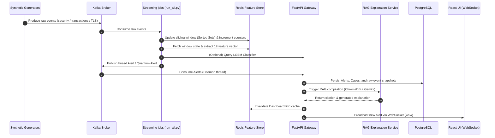

# 🔄 User Flow & Logic Flow Documentation

This document describes how data flows through the **PRAHARI** system and how analysts interact with the application.

---

## 🧑‍💻 User Flow (SOC & Fraud Analyst)

The PRAHARI user experience follows the **Progressive Disclosure Pattern** to prevent alert fatigue, only surfacing complex data as the analyst drill-downs.

```text
  [Level 1: Dashboard KPIs] 
            │
            ▼ (Click KPI Card)
  [Level 2: Anomalies Queue]
            │
            ▼ (Click Alert Row)
  [Level 3: Investigation Workspace] ➔ [Explanation] ➔ [Risk Profile] ➔ [Timeline]
            │
            ▼ (Remediation)
  [Action Executed] ➔ [Case Closed / Escalated] ➔ [Immutable Audit Trail]
```

### 1. Level 1: Dashboard KPIs
When the analyst logs in, they are presented with a clean dashboard summarizing:
*   **Total Active Anomalies**: Fused alerts needing triage.
*   **High Risk Identities**: Customer accounts flagged with high individual risk scores.
*   **HNDL Session Exposure**: Legacy cryptographic TLS handshakes exposing sensitive data.
*   *If WebSockets are connected, a green status bar glows in the header. If connection is lost, it falls back to REST polling.*

### 2. Level 2: Anomalies Queue
Clicking on any KPI card redirects the analyst to the relevant table view.
*   The analyst sees the list of alerts complete with severity tags, timestamps, unique identity IDs, and specific anomaly signals.

### 3. Level 3: Investigation Workspace
Clicking a specific row opens a side drawer (960px width) containing three key sections:
- **RAG Explanation**: A generative summary citing specific RBI compliance violations.
- **Risk Profile**: Comprehensive customer profile parameters (KYC status, accounts balance, registered device list, beneficiary list, historical fraudulent transactions).
- **Incident Timeline**: A combined vertical timeline showing security and transaction activities leading to the alert.

### 4. Resolution & Auditing
At the bottom of the drawer, the analyst can either:
- **Dismiss False Positive**: Dismisses the case. Prompts the analyst for a reason, closing the alert and registering a `DISMISS` action.
- **Escalate to Tier 2**: Escalates the case, marking the status as `escalated` and logging an `ESCALATE` action.
- *Every single action writes an immutable transaction log to the PostgreSQL `audit_trail` table.*

---

## ⚙️ Logic Flow (Under the Hood)

The following steps detail how events are captured, processed, correlated, and displayed in real time:



### Key Stages

1.  **Ingestion**: Telemetry generators write events to the `security-telemetry`, `transaction-events`, and `tls-handshake` Kafka topics.
2.  **State Aggregation**: The streaming consumers (`streaming.run_all`) process messages and store them in Redis sorted sets.
3.  **Sliding Window Correlation**: When new transaction events arrive, the consumer pulls the last 15 minutes of security events for the same `identity_id`.
4.  **Classification**: Feature vectors are sent to the classification microservice to yield a fusion score. If the score triggers severity thresholds, a fused alert payload containing raw events is pushed to the `fusion-alerts` Kafka topic.
5.  **Gateway Broadcast**: The gateway consumer detects the fused alert, commits it to Postgres, launches an async RAG explanation generation, invalidates Redis caching, and triggers a JSON payload transmission down the client WebSockets.
